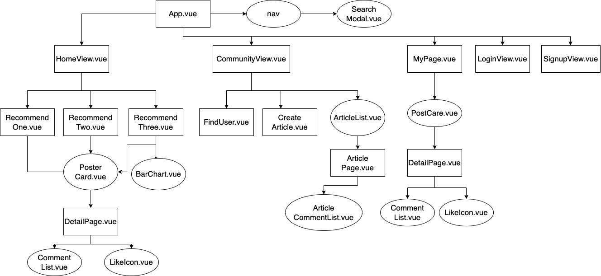
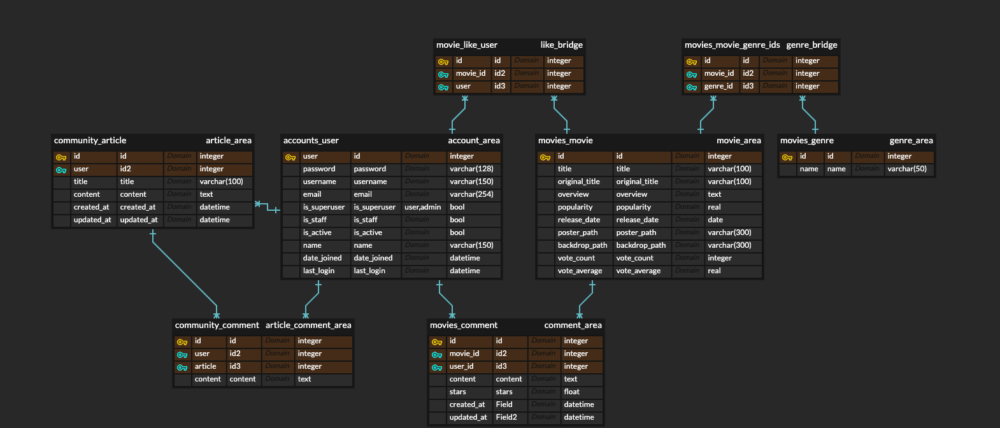
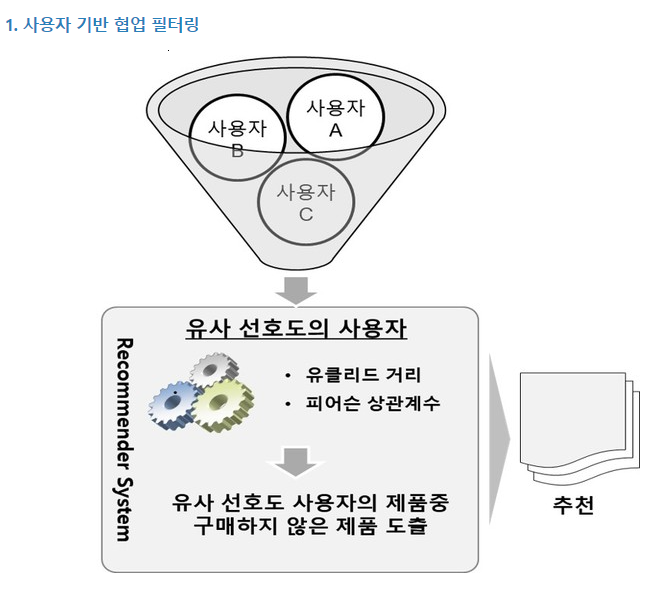
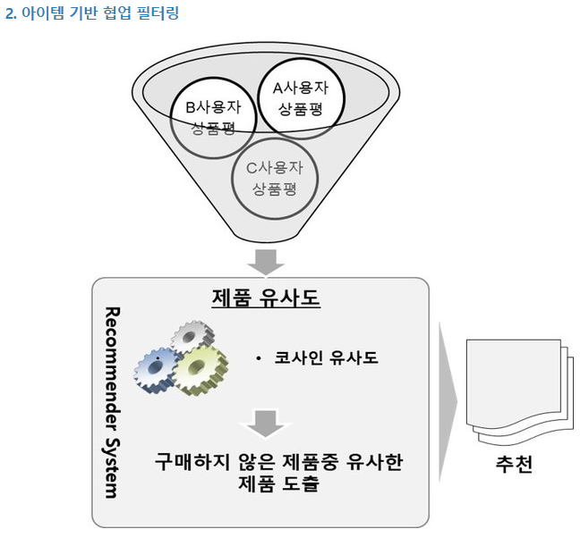
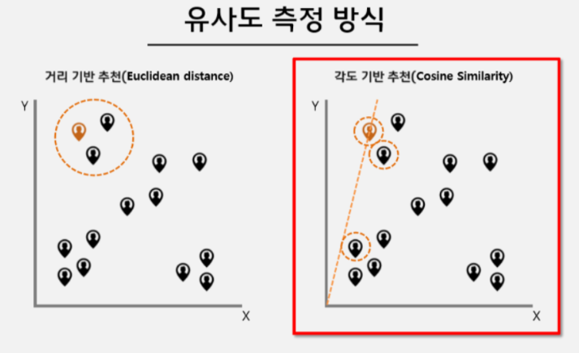

# 1. 팀원 정보 및 업무 분담내역

- #### 팀장 인수경
  
  팀장 & 프론트엔드 & PPT 제작 & 발표 담당

- #### 팀원 송경삼
  
  백엔드 & 알고리즘 담당
  
  

# 2. 목표 서비스 구현 및 실제 구현 정도

  영화 추천을 사용자의 입맛에 맞게 추천할 수 있도록 다양한 컨텐츠를 제공하는 방향으로 잡았습니다. 원래 서비스 하고자 했던 목표 서비스에서 빠진 것은 두 세개 정도 있습니다.

# 3. ERD

- 프론트엔드 ERD

- 백엔드 ERD

# 4. 영화 추천 알고리즘 기술적 설명

우선 영화 추천 알고리즘에 대해 검색을 했습니다.

추천 알고리즘은 크게 몇가지의 케이스로 나눌 수 있는 것을 배웠고, 그 중 가장 눈에 띄는 것이 사용자 기반 협업 필터링과 아이템 기반 협업 필터링입니다. 

간단하게 말해 전자는 사용자끼리의 얼마나 비슷한가 로 자신과 비슷한 사용자들이 어떤 영화를 보는가?

후자는 각 아이템이 사용자들에게 어떤 평가를받는가 입니다.

두 방법 모두 장단점이 존재하기에 현재 다양한 기업들에서는 각각의 단점을 희석시키기 위해 이 두 방법을 섞어서 추천해주는 알고리즘을 사용하고 있다는 것 또한 알고있습니다.

하지만 저희는 전자의 '나와 비슷한 사용자'라는 지표를 구하는 과정에 초점을 맞춰서 커뮤니티쪽에서 나와 비슷한 사용자 자체를 추천해주는 방식은 어떨까 생각했습니다.

그래서 후자는 영화 추천용으로, 전자는 유저 추천용으로 둘 다 활용하기로했습니다.

이 과정에서 사용되는 기술은 여러가지가 있지만 코사인 유사도를 주력 기술로 사용하려고 했습니다.

그래서 다른 간단한 알고리즘 들은 거의 제외하고

저희 팀의 메인 추천 컨텐츠는 영화를 추천해주는 콘텐츠 기반 협업 필터링, 비슷한 유저를 추천해주는 사용자 기반 협업 필터링입니다.

# 5. 서비스 대표 기능에 대한 설명

저희 팀은 사용자에게 맞는 영화 퍼즐조각을 찾는 것이었습니다. 따라서 사용자에게 최적으로 맞는 퍼즐조각을 추천하는 것이 저희 서비스의 대표 기능입니다. 코사인 유사도를 이용한 영화 추천과 사용자의 영화 선호도에 대한 분석, 나와 비슷한 유저를 찾아 볼 수 있는 기능 등 다양한 맞춤 서비스를 제공합니다.

# 6. 느낀점 후기

저희는 크게 설계, 개발, 마무리 단계로 나누어 느낀점을 설명하겠습니다.

설계 단계에서는 우선, 테마와 목표를 정하기 시작했습니다. 테마는 오랜 고민 끝에 영화조각을 찾아주자는 테마로 방향을 잡았고 목표는 사용자 입맛 따라 고를 수 있는 다양한 알고리즘을 구성하는 취지로 시작했습니다. 설계 단계에서는 ERD 짜는 것이 가장 오래 걸렸습니다. 우선, 설계에서 ERD를 탄탄히 짜놔야 개발을하면서 꼬이지 않는데, 아무런 코딩 없이 ERD만 그리기 시작하니 감이 잘 안잡혀서 설계하는데에 꽤 오래걸렸습니다. 아마 그동안 

개발 단계에서 가장 힘들었던 것은 협업툴의 사용입니다. 데이터 관리를 위해 깃 브랜치를 이용하였는데, merge할때 마다 오류가 나서 정말 힘들었습니다. 데이터도 많이 날라가서 다시 복구하느라 고생했습니다. 그리고, 어떤 방식이 효율적인지 고민하는 것에 시간을 너무 많이 허비했습니다.

개발 단계서 부터 마무리 단계까지 꾸준히 어려웠던 것은 DB였습니다. DB의 정보가 부족하니, vue와 django 에서 각각 더미 데이터를 계속 만들어야 했던 것도 힘들었지만 알고리즘을 구현할 때 미리 저장되어있는 데이터의 개수가 부족한게 제일 힘들었습니다. 알고리즘의 허점이 어디인가  알아내기도 힘들었고, 그렇다고 더미 데이터를 따로 만들자니 깃 브랜치를 merge할 때마다 DB가 충돌되어 상당한 고생이 있었습니다.

마무리 단계를 보내오면서 가장 부족한 점은 디테일을 정하는 것입니다. 바쁜 일정 와중에도 일정을 종종잡아 페어 프로그래밍을 해왔는데 각자의 생각이 똑같지 않으니 의사소통의 어려움이 있었습니다 때문에, 디테일이 각자 달라 백과 프론트를 연결할 때에 사소한 시간낭비가 있었습니다. 하지만 페어와 마음은 잘 통해서 즐거웠습니다.

